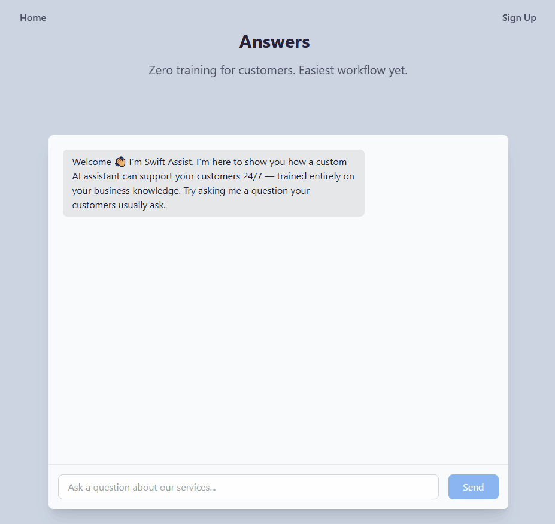
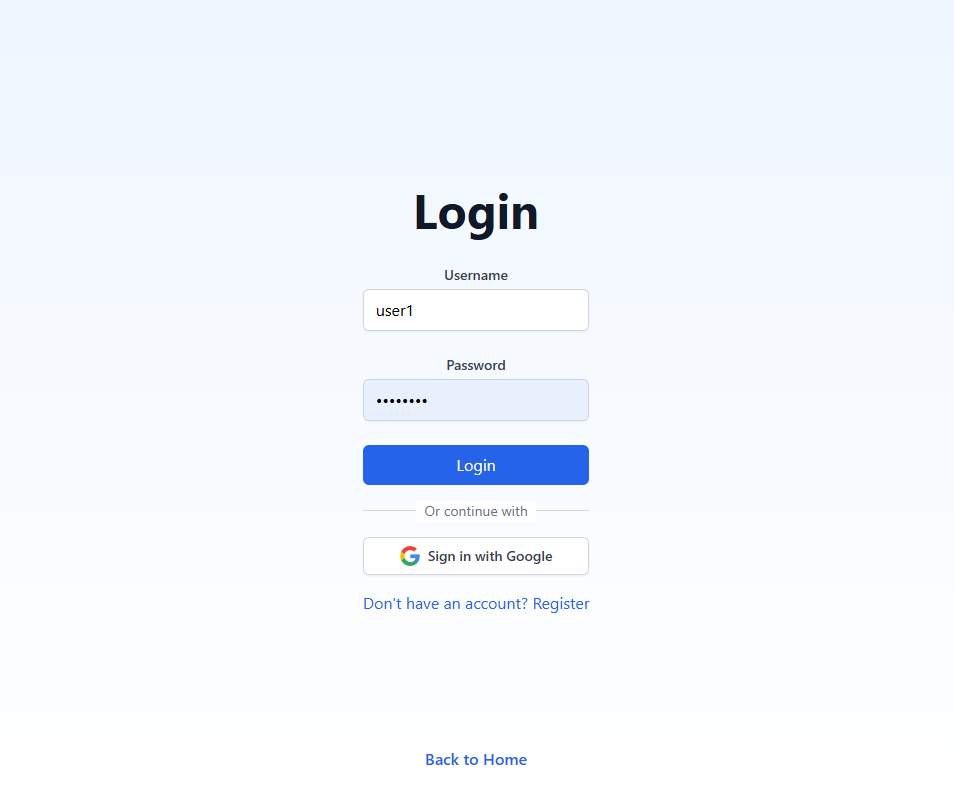
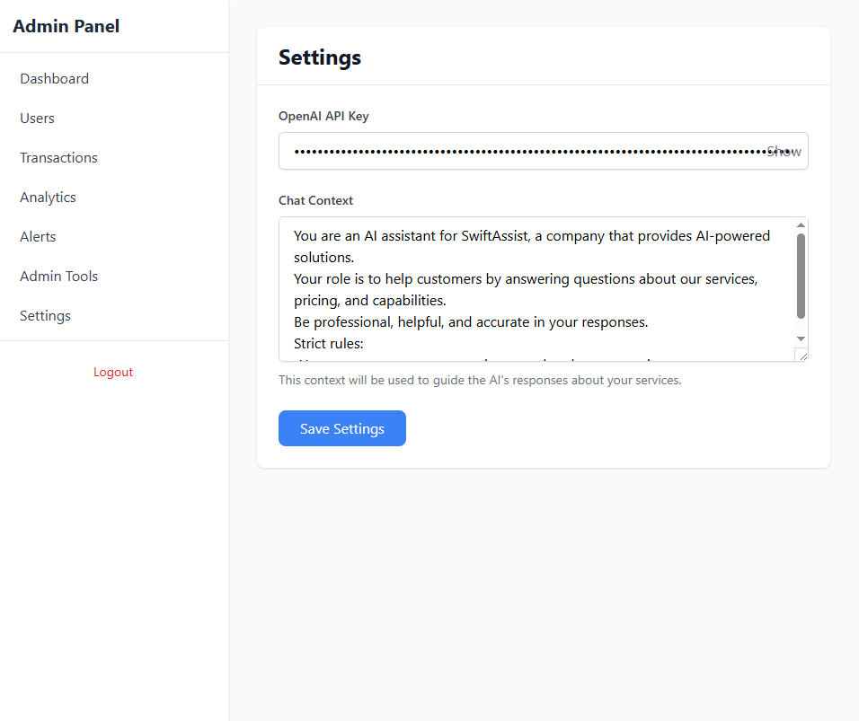

# Swift Assist - AI-Powered Customer Support Platform

An intelligent customer support platform that provides 24/7 AI-powered chat assistance to your customers.

## Features

- **AI Chat Interface** - Powered by OpenAI GPT-3.5-turbo for intelligent customer interactions
- **User Authentication** - Secure login with Supabase Auth and Google OAuth integration
- **Admin Dashboard** - Manage users, settings, and chat templates
- **Customizable Context** - Configure AI behavior per customer or globally
- **Real-time Chat** - Responsive chat interface with conversation history
- **Role-Based Access** - Separate admin and user dashboards

## Screenshots & Demos

### Home / Landing Page


### Real-Time Chat


### Authentication


### Admin Customization Panel


## Tech Stack

- **Frontend:** React 19, React Router, Tailwind CSS, Material-UI
- **Backend:** Supabase (PostgreSQL, Auth, Real-time)
- **AI:** OpenAI API (GPT-3.5-turbo)
- **Authentication:** Supabase Auth, Google OAuth
- **Styling:** Tailwind CSS, Emotion

## Prerequisites

- Node.js 16+ and npm
- Supabase account and project
- OpenAI API key
- Google OAuth credentials (optional, for Google sign-in)

## Setup Instructions

### 1. Clone the Repository

```bash
git clone https://github.com/generaljudas/swift-assist.git
cd swift-assist
```

### 2. Install Dependencies

```bash
npm install
```

### 3. Configure Environment Variables

Create a `.env.local` file in the root directory:

```bash
cp .env.example .env.local
```

Edit `.env.local` and add your credentials:

```env
REACT_APP_SUPABASE_URL=your_supabase_project_url
REACT_APP_SUPABASE_ANON_KEY=your_supabase_anon_key
REACT_APP_GOOGLE_CLIENT_ID=your_google_oauth_client_id
```

**⚠️ NEVER commit `.env.local` to git!**

### 4. Set Up Supabase Database

Run the SQL schema from `supabase-schema.sql` in your Supabase SQL editor to create the necessary tables.

### 5. Configure OpenAI API Key

1. Start the application (see below)
2. Login as an admin
3. Navigate to Settings
4. Add your OpenAI API key

### 6. Start Development Server

```bash
npm start
```

The app will open at [http://localhost:3000](http://localhost:3000)

## Available Scripts

### `npm start`

Runs the app in development mode. Open [http://localhost:3000](http://localhost:3000) to view it in your browser.

### `npm test`

Launches the test runner in interactive watch mode.

### `npm run build`

Builds the app for production to the `build` folder. Optimizes the build for best performance.

## Project Structure

```
swift-assist/
├── public/              # Static assets
├── src/
│   ├── components/      # React components
│   │   ├── AdminDashboard.js
│   │   ├── Chat.js
│   │   ├── Login.js
│   │   └── ...
│   ├── services/        # Business logic and API calls
│   │   ├── authService.js
│   │   ├── chatService.js
│   │   └── ...
│   ├── utils/           # Utility functions and clients
│   │   └── supabaseClient.js
│   ├── App.js           # Main app component and routing
│   └── index.js         # App entry point
├── .env.example         # Environment variables template
├── package.json         # Dependencies and scripts
└── README.md           # This file
```

## Security Notes

- **Never commit sensitive credentials** - All secrets should be in `.env.local` (not tracked by git)
- **Rotate exposed credentials** - If you accidentally commit credentials, rotate them immediately
- **Environment variables** - Always use `process.env.REACT_APP_*` for configuration
- **API keys** - Store OpenAI API keys in Supabase or admin settings, not in code

## Current Status

🚧 **This project is under active refactoring and cleanup** 🚧

We're improving code quality, security, and maintainability. See `MASTER_PLAN.md` for details.

## Contributing

This project uses a coordinated development workflow with multiple contributors. Please see:
- `MASTER_PLAN.md` - Overall coordination and progress
- `WORK_COMPUTER_1_LEADER.md` - Backend and infrastructure tasks
- `WORK_COMPUTER_2_WORKER.md` - Frontend and component tasks

## Deployment

### Build for Production

```bash
npm run build
```

The build folder will contain optimized production files ready for deployment.

### Deploy to Vercel (Recommended)

1. Install Vercel CLI: `npm i -g vercel`
2. Run: `vercel`
3. Add environment variables in Vercel dashboard
4. Deploy: `vercel --prod`

### Deploy to Netlify

1. Build: `npm run build`
2. Deploy the `build` folder to Netlify
3. Configure environment variables in Netlify dashboard

## Troubleshooting

### "Missing Supabase environment variables"

Make sure you've created `.env.local` and added your Supabase credentials.

### "Authentication failed"

Check that your Supabase URL and anon key are correct in `.env.local`.

### Chat not working

Ensure you've configured the OpenAI API key in the admin settings.

## License

Private - All rights reserved

## Support

For issues or questions, please open an issue on GitHub.

